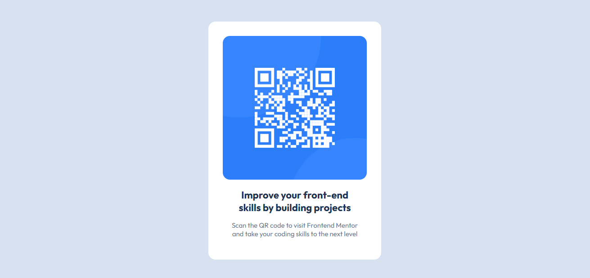
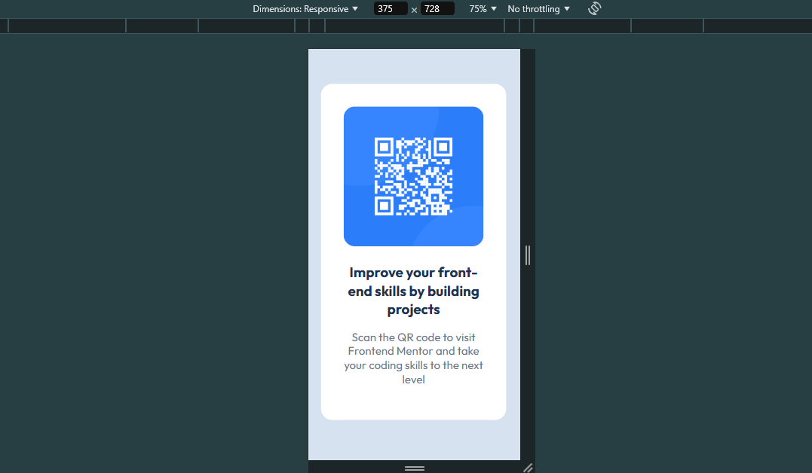

# Frontend Mentor - QR code component solution

This is a solution to the [QR code component challenge on Frontend Mentor](https://www.frontendmentor.io/challenges/qr-code-component-iux_sIO_H).

## Table of contents
  - [Screenshot](#screenshot)
  - [Links](#links)
- [My process](#my-process)
  - [Built with](#built-with)
  - [Useful resources](#useful-resources)
- [Author](#author)

### Screenshot

### Links

- Solution URL: https://github.com/stephenakinrodoye/QR-Code-Component.git
- Live Site URL: https://qr-code-component-rouge-pi.vercel.app/

## My process
HTML ans CSS was used for the desktop version folloewd by media query for mobile responsiveness

### Built with

- Semantic HTML5 markup
- CSS custom properties
- Flexbox

### Useful resources

- https://web.dev/learn/css/
- https://developer.mozilla.org/en-US/docs/Web/CSS/CSS_media_queries/Using_media_queries

## Author
- Website - [Stephen Akinrodoye](https://stephenakinrodoye-dev.vercel.app/)
- Frontend Mentor - [@stephenakinrodoye](https://www.frontendmentor.io/profile/stephenakinrodoye)
- Twitter - [@Stephen_Akinrod](https://x.com/Stephen_Akinrod)